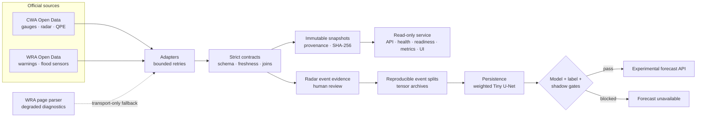

# MinxiongHydroCast

[](https://github.com/KageRyo/MinxiongHydroCast/actions/workflows/ci.yml)
[](https://github.com/KageRyo/MinxiongHydroCast/actions/workflows/codeql.yml)
[](https://github.com/KageRyo/MinxiongHydroCast/releases)
[](https://www.python.org/)
[](https://github.com/KageRyo/MinxiongHydroCast/blob/main/LICENSE)
[](https://github.com/KageRyo/MinxiongHydroCast/blob/main/docs/project_scope.md)
[](https://github.com/KageRyo/MinxiongHydroCast/blob/main/docs/operational_use.md#production-gates)

Official-source hydrometeorological observations and reproducible rainfall-nowcasting research for
Minxiong, Taiwan.

**Status: Operational Prototype / Active Research.** The observation service is usable on a
localhost-only deployment. Forecast publication and automated risk notifications remain disabled
until the model, label, and shadow-deployment gates pass.


_Real localhost operator view captured on 2026-07-29. It uses live official observations; values
change over time. The blocked shadow gate is intentional._

## What problem does this solve?

Official rainfall, radar, warning, and flood-sensor feeds are useful but have different schemas,
cadences, failure modes, and retention windows. A downloader alone cannot answer whether a
snapshot is fresh, internally consistent, reproducible, or safe to expose.

MinxiongHydroCast turns those feeds into a fail-closed observation and research system:

- strict Pydantic contracts, freshness checks, and cross-page WRA sensor joins;
- bounded retries and explicitly degraded fallbacks without hiding schema drift;
- immutable snapshots with SHA-256, source authority, dataset ID, fetch time, and adapter version;
- CLI, read-only API, health/readiness endpoints, Prometheus metrics, backup, and operator view;
- reproducible CWA radar event datasets with human-reviewed evidence and fixed event splits;
- Persistence and Tiny U-Net evaluation behind promotion gates that can block publication.

That operational and scientific boundary is the main difference from a general weather-data
download script.

## Architecture



Schema drift, invalid units or timestamps, broken measurement/catalog joins, and unexpected empty
observation sets fail the attempt. The optional scraper fallback is limited to transport,
authentication, timeout, HTTP, or rate-limit failures and never satisfies readiness. See the
[architecture](https://github.com/KageRyo/MinxiongHydroCast/blob/main/docs/architecture.md)
and [data contracts](https://github.com/KageRyo/MinxiongHydroCast/blob/main/docs/data_contracts.md).

## Official data flow

| Product | Authority and dataset | Use | Repository behavior |
| --- | --- | --- | --- |
| Rain gauges | CWA [`O-A0002-001`](https://opendata.cwa.gov.tw/dataset/observation/O-A0002-001) | Chiayi rainfall observations | Strict schema and 30-minute freshness gate |
| Rainfall warnings | WRA OpenApiv3 `Rainfall/Warning` | Active Chiayi warning context | Authenticated API; validated `Data=[]` is healthy |
| Flood sensors | WRA IoW Open Data [142980](https://data.gov.tw/dataset/142980) + [142979](https://data.gov.tw/dataset/142979) | Measurement/catalog join | Bounded full-transaction retry and 90-minute freshness gate |
| Radar | CWA `O-A0059-001` | 10-to-60-minute research nowcasting | External event archives; checksummed fixed splits |
| QPE | CWA `O-B0045-001` | Radar/gauge validation evidence | External synchronized evidence; not committed |

API keys, official raw files, research evidence, model weights, live snapshots, CCTV, and host
configuration are not committed. The
[source register](https://github.com/KageRyo/MinxiongHydroCast/blob/main/docs/data_source_register.md)
records
authority, acceptance, and redistribution questions.

## Current status

Public-safe verification on **2026-07-29**:

| Layer | Maturity | Evidence |
| --- | --- | --- |
| Observation service | Operational Prototype | Latest live snapshot healthy: 80 CWA gauges, 150 WRA flood sensors, validated empty warning set |
| Reliability | Active | 1,150 rolling attempts; 99.39% success and 97.39% readiness |
| Shadow gate | Blocked | Maximum ready-data gap 50.98 minutes; no confirmed heavy-rain period |
| Radar dataset | Active Research | Five real CWA events: 2 train / 1 validation / 2 held-out local tests |
| Forecast API | Disabled | Tiny U-Net does not consistently beat Persistence on CSI and lead-time gates |

These are dated observations, not an availability promise. The current public-safe rollout record
is in
[deployment status](https://github.com/KageRyo/MinxiongHydroCast/blob/main/docs/deployment_status.md).

## Baseline results

The formal experiment uses six radar input frames to predict six target frames at 10-minute
cadence. Metrics below use independent validation/test events; lower RMSE and higher CSI are
better.

| Event | Split | Persistence RMSE | Tiny U-Net RMSE | Persistence CSI | Tiny U-Net CSI |
| --- | --- | ---: | ---: | ---: | ---: |
| Taiwan 2026-07-09 | validation | 9.654280 | **8.053179** | 0.188989 | **0.205842** |
| Minxiong/Chiayi 2026-07-03 | test | 10.421478 | **9.186911** | **0.315475** | 0.294527 |
| Minxiong/Chiayi 2026-07-11 | test | 9.154027 | **8.218313** | 0.119412 | **0.122282** |

The weighted Tiny U-Net lowers aggregate RMSE on all three events, but CSI regresses on one local
test event and some 10-to-60-minute lead-time gates regress. Therefore
`forecast_publication_ready=false`; Persistence remains the required benchmark. See the full
[baseline results](https://github.com/KageRyo/MinxiongHydroCast/blob/main/docs/baseline_results.md),
[model card](https://github.com/KageRyo/MinxiongHydroCast/blob/main/docs/model_cards/minxiong_chiayi_baseline.md),
and
[reproducibility evidence](https://github.com/KageRyo/MinxiongHydroCast/blob/main/docs/research_dataset.md).

## Quick Start

Python 3.11 and 3.13 are tested in CI.

The fastest path is a credential-free, synthetic demo:

```bash
docker compose up --build
```

Open <http://127.0.0.1:8080/>. The dashboard shows demo rain gauges and flood sensors,
`/healthz`, intentionally blocked `/readyz`, Prometheus `/metrics`, and the forecast publication
gate. No API key or live official request is used.

If port 8080 is already in use, choose another host port:

```bash
MHC_DEMO_PORT=18080 docker compose up --build
```


_A 60-second capture of the credential-free synthetic stack. Every source is classified as
`demo_fixture`; readiness and forecast publication stay blocked._

For a local Python installation:

```bash
python3 -m venv .venv
source .venv/bin/activate
python -m pip install -e ".[dev]"
```

Create a deterministic demo snapshot without contacting live sources, then open the operator view:

```bash
mhc collect --region minxiong --mode demo --once
mhc serve --host 127.0.0.1 --port 8080
```

In another terminal:

```bash
curl --fail http://127.0.0.1:8080/healthz
```

Open <http://127.0.0.1:8080/>. Demo data intentionally does not pass readiness. Live collection
requires CWA/WRA credentials in an ignored `.env`; follow
[operational use](https://github.com/KageRyo/MinxiongHydroCast/blob/main/docs/operational_use.md#run-the-observation-service)
rather than placing secrets
on the command line.

Useful entry points:

```bash
mhc --help
mhc collect --help
mhc serve --help
mhc dataset build --help
mhc event queue --help
mhc model evaluate --help
mhc model evaluate-optical-flow --help
mhc model optical-flow-report --help
mhc operations backup --help
```

The base wheel installs only Pydantic, Requests, and NumPy. Install capability extras only when
needed:

```bash
pip install "minxiong-hydrocast[scraper]"
pip install "minxiong-hydrocast[model]"
pip install "minxiong-hydrocast[report]"
```

## Example output

A live `/readyz` response can be reduced to the service contract with:

```bash
curl --silent http://127.0.0.1:8080/readyz |
  jq '{state, ready, latest_snapshot: {mode: .latest_snapshot.mode},
       latest_attempt: {status: .latest_attempt.status}}'
```

```json
{
  "state": "healthy",
  "ready": true,
  "latest_snapshot": {"mode": "live"},
  "latest_attempt": {"status": "ok"}
}
```

The service also exposes `/healthz`, `/metrics`, `/api/v1/status`, official observations,
region features, locations, shadow readiness, and a fail-closed experimental forecast endpoint.

## Evaluation and tests

```bash
python -m compileall -q src tests scripts
python -m ruff check .
python -m pytest -q
```

CI runs the same quality gates on Python 3.11 and 3.13. CodeQL, Dependabot, secret scanning, and
protected `main` rules provide repository-level controls. A separate clean-wheel job builds both
distributions, installs the wheel, verifies that `mhc` is the only executable, and exercises the
synthetic API/readiness/metrics/forecast-gate flow. Scheduled live-contract checks detect upstream
CWA/WRA changes without printing credentials.

## Limitations

- This is not an official warning system, public forecast service, or emergency decision tool.
- Five radar events do not cover enough typhoon, frontal, Mei-yu, and convective regimes.
- Radar reflectivity is not surface rainfall or flood depth; QPE/gauge validation is incomplete.
- Reviewed local flood labels have not reached the 10-positive / 20-negative minimum.
- The rolling shadow gate still lacks a confirmed heavy-rain period and has a gap above 30 minutes.
- Official data and trained-weight redistribution rights require separate review.
- The supplied deployment profile is localhost-only; public ingress requires authentication, TLS,
  ownership, incident response, and completed gates.

## Data, model, and code license

Repository code is released under the
[MIT License](https://github.com/KageRyo/MinxiongHydroCast/blob/main/LICENSE). That license does
not relicense CWA
or WRA data, third-party documents, research evidence, or trained weights. This repository ships
schemas and synthetic samples, not an official dataset or model checkpoint. Review the
[data source register](https://github.com/KageRyo/MinxiongHydroCast/blob/main/docs/data_source_register.md)
and each authority's terms before
redistribution or commercial use.

## Roadmap and releases

| Version | Milestone | State |
| --- | --- | --- |
| [`v0.1.0`](https://github.com/KageRyo/MinxiongHydroCast/releases/tag/v0.1.0) | Observation Service | Previous release |
| [`v0.1.1`](https://github.com/KageRyo/MinxiongHydroCast/releases/tag/v0.1.1) | One-command demo, lean package, region/adapter contracts, contributor entry | Previous release |
| [`v0.1.2`](https://github.com/KageRyo/MinxiongHydroCast/releases/tag/v0.1.2) | Deterministic optical-flow benchmark and public-safe comparison report | Current release |
| `v0.2.0` | Reproducible Radar Dataset | Planned; requires broader reviewed event diversity |
| `v0.3.0` | Baseline Nowcasting | Planned; requires model, label, and lead-time gates |

See [CHANGELOG.md](https://github.com/KageRyo/MinxiongHydroCast/blob/main/CHANGELOG.md), the
[v0.1.2 release notes](https://github.com/KageRyo/MinxiongHydroCast/blob/main/docs/releases/v0.1.2.md),
and the long-term
[roadmap](https://github.com/KageRyo/MinxiongHydroCast/blob/main/docs/roadmap.md). Current work
belongs in [tasks](https://github.com/KageRyo/MinxiongHydroCast/blob/main/docs/tasks.md); generated
deployment numbers do not belong in the README.

## Documentation

- Start here:
  [documentation index](https://github.com/KageRyo/MinxiongHydroCast/blob/main/docs/index.md),
  [project scope](https://github.com/KageRyo/MinxiongHydroCast/blob/main/docs/project_scope.md),
  [architecture](https://github.com/KageRyo/MinxiongHydroCast/blob/main/docs/architecture.md)
- Operate:
  [operational use](https://github.com/KageRyo/MinxiongHydroCast/blob/main/docs/operational_use.md),
  [single-host runbook](https://github.com/KageRyo/MinxiongHydroCast/blob/main/docs/single_host_operations.md),
  [incident response](https://github.com/KageRyo/MinxiongHydroCast/blob/main/docs/incident_response.md),
  [rollback](https://github.com/KageRyo/MinxiongHydroCast/blob/main/docs/rollback.md)
- Contracts:
  [data contracts](https://github.com/KageRyo/MinxiongHydroCast/blob/main/docs/data_contracts.md),
  [source register](https://github.com/KageRyo/MinxiongHydroCast/blob/main/docs/data_source_register.md),
  [spatial alignment](https://github.com/KageRyo/MinxiongHydroCast/blob/main/docs/spatial_alignment.md),
  [region profiles](https://github.com/KageRyo/MinxiongHydroCast/blob/main/docs/region_profiles.md),
  [adapter development](https://github.com/KageRyo/MinxiongHydroCast/blob/main/docs/adapter_development.md)
- Research:
  [dataset build](https://github.com/KageRyo/MinxiongHydroCast/blob/main/docs/research_dataset.md),
  [event evidence and review](https://github.com/KageRyo/MinxiongHydroCast/blob/main/docs/continuous_event_evidence.md),
  [baseline results](https://github.com/KageRyo/MinxiongHydroCast/blob/main/docs/baseline_results.md),
  [model card](https://github.com/KageRyo/MinxiongHydroCast/blob/main/docs/model_cards/minxiong_chiayi_baseline.md)
- Governance:
  [decision authority](https://github.com/KageRyo/MinxiongHydroCast/blob/main/docs/decision_authority.md),
  [security policy](https://github.com/KageRyo/MinxiongHydroCast/blob/main/SECURITY.md),
  [contributing](https://github.com/KageRyo/MinxiongHydroCast/blob/main/CONTRIBUTING.md),
  [roadmap](https://github.com/KageRyo/MinxiongHydroCast/blob/main/docs/roadmap.md),
  [tasks](https://github.com/KageRyo/MinxiongHydroCast/blob/main/docs/tasks.md)
