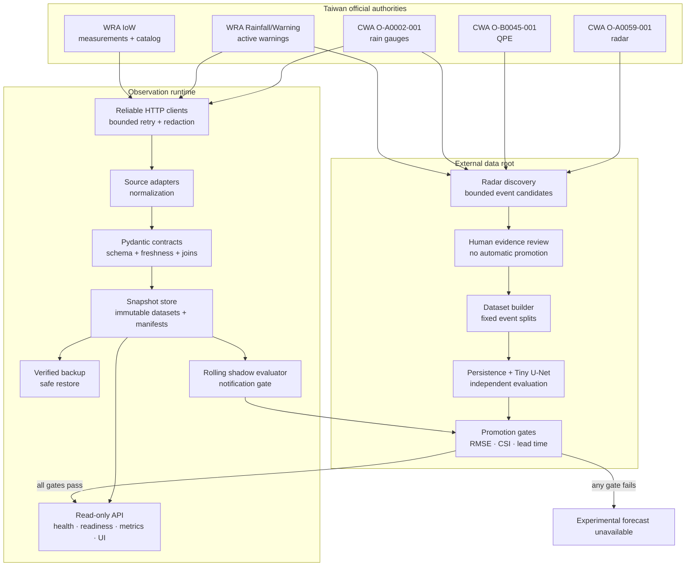

# Architecture

MinxiongHydroCast has two connected but separately gated capabilities:

1. a localhost-only official-source observation service;
2. a reproducible radar-nowcasting data and model pipeline.

The observation service may be healthy while forecast publication remains blocked. No model result
can bypass data readiness, label, shadow, and promotion gates.

## System context

## Components

| Component | Responsibility | Failure behavior |
| --- | --- | --- |
| Reliable HTTP client | Timeouts, bounded retry, TLS verification, credential redaction | Exhausted transient failures surface as collection errors |
| Source adapters | Parse CWA/WRA products into stable fields and units | Invalid JSON or source-specific schema errors are explicit |
| WRA flood join | Join paginated measurement and sensor-catalog snapshots | Retries the bounded full transaction when the two feeds change mid-join |
| Contracts | Validate fields, units, timestamps, row counts, joins, and freshness | Fail closed; schema drift does not invoke a scraper |
| Snapshot store | Persist datasets, manifests, provenance, SHA-256, and health atomically | Failed collection updates the attempt journal but does not replace the latest readable snapshot |
| API/operator view | Expose read-only state, observations, metrics, and gate reasons | `/readyz` returns 503 for demo, stale, invalid, degraded, or failed data |
| Shadow evaluator | Audit rolling success, readiness, gaps, integrity, and reviewed heavy-rain coverage | Notification remains disabled until every criterion passes |
| Event evidence | Synchronize radar, QPE, gauges, warnings, and official context | Candidates remain outside formal splits until a human decision |
| Dataset builder | Rebuild fixed event splits and checksummed tensor/report catalogs | Invalid evidence, checksum drift, or split leakage aborts the build |
| Model promotion | Compare learned models with Persistence on independent events and lead times | Any required regression keeps forecast publication disabled |

## Observation data path

1. The collector fetches official products with per-source timeouts and bounded retries.
2. Adapters normalize records while preserving source authority, dataset ID, redacted URL, fetch
   time, adapter schema version, and content hash.
3. Strict contracts validate schemas, timestamps, units, joins, row expectations, and freshness.
4. A successful collection is written as a new immutable snapshot. A failure never mutates a
   previous snapshot.
5. The API derives liveness from the process and readiness from the latest attempt plus latest
   snapshot. Those concepts intentionally differ.
6. Prometheus metrics, the operator view, backups, and the shadow evaluator read the same store.

The WRA page parser is a degraded diagnostic fallback only for authentication, timeout, transport,
HTTP, or rate-limit failures. It cannot convert malformed official payloads into healthy data and
cannot satisfy readiness.

## Data and model asset path

1. Radar discovery scans official CWA history metadata and creates bounded candidates only from
   configured local triggers.
2. Radar frames and synchronized QPE, gauge, warning, and official-context artifacts are stored
   outside Git with checksums.
3. A read-only queue ranks review work. A human reviewer alone may approve or reject a candidate.
4. Approved evidence may be referenced by a later formal split change; discovery never edits the
   split.
5. The dataset builder reconstructs event archives, evaluates Persistence, trains the optional
   weighted Tiny U-Net, and verifies the artifact catalog.
6. Independent validation/test and per-lead-time gates determine whether model output is eligible
   for publication.

## Trust and publication boundaries

| Tracked and public-safe | External or private |
| --- | --- |
| Source code, schemas, tests, synthetic samples | API keys, cookies, webhook URLs |
| Architecture, contracts, model card, aggregate benchmark tables | Official raw downloads and short-retention evidence |
| API examples with credentials redacted | Live snapshots, notification logs, backup archives |
| Deployment templates with generic paths | Hostnames, mount locations, runner identity, internal service inventory |
| Checksummed manifest formats | CCTV, personal data, unpublished labels, model weights |

The repository ignore rules cover generated data and common credential files, but ignore rules are
not a substitute for review. Before publishing a change, inspect tracked paths, staged diffs, and
GitHub secret-scanning results. See [SECURITY.md](../SECURITY.md) and the
[source register](data_source_register.md).

## Deployment boundary

The supplied systemd profile binds the API, Prometheus, Alertmanager, and audit receiver to
loopback. Mutable state is selected at installation time and linked through a stable user-local
runtime path. A public deployment would require authenticated TLS ingress, documented ownership,
remote backup, incident exercises, and completed observation/model gates; those controls are not
implied by this repository.
